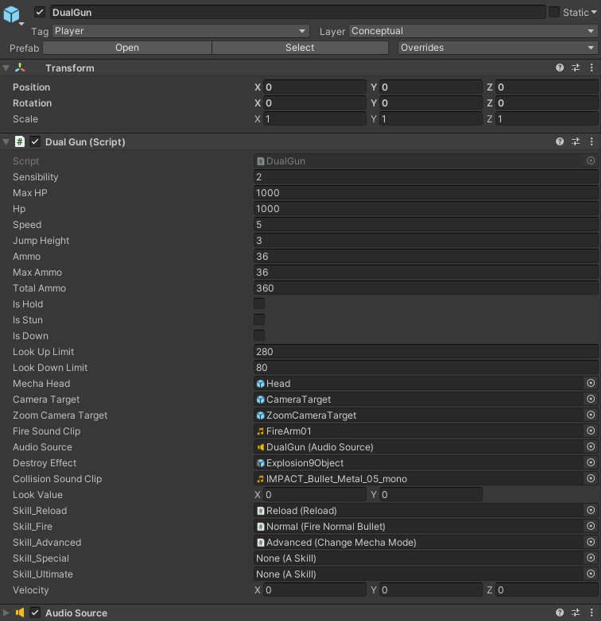
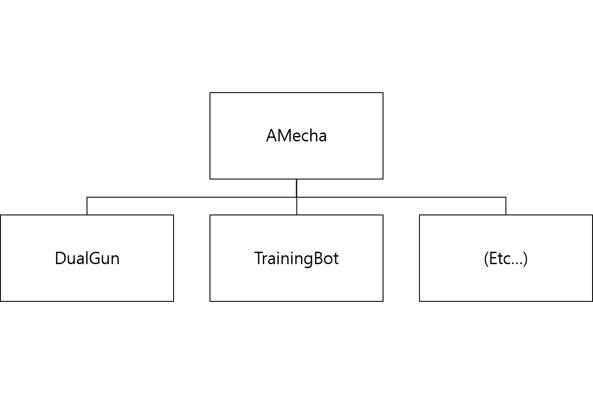
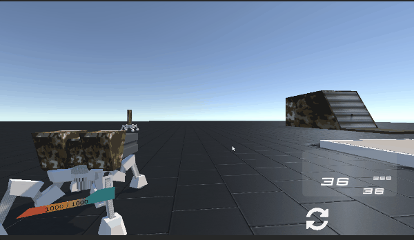

# UnityFPSProject 사용 기술 설명

### 1. inspector assignment로 연산 절약



- [다음 링크](https://starmanta.gitbooks.io/unitytipsredux/content/first-question.html)에서 권장하는 inspector assignment식 구조로 연산을 절약.

___

### 2. 상속 구조화

- 확장성을 고려, Mecha간의 공통점을 추출하여 AMecha 부모 class 제작.
- 부모가 되는 AMecha 클래스 생성 및 각 자식 클래스에게 상속
- AMecha를 상속받음으로서 추가적인 Mecha를 생성 가능



- Dependency Injection 구조 지향
  - 예시 ) AMecha를 인자로 받는 Player. 객체 의존성을 상위(여기서는 player)에 맡김.
  - 기능을 하위 클래스의 구현에 의존하지 않음으로서 모듈을 교체하기 쉬움
``` cs
public class Player : MonoBehaviour
{
    //전략

    private void Start()
    {
        //...
        fireAction = playerInput.actions[Skill1FireInputName];
        //...
    }

    //Player는 이 객체가 무엇이든지간에 AMecha이기만 하면 명령을 전달할 수 있다.
    //궁극적으로, Player는 AMecha를 상속받는 그 어떤 객체라도 제어할 수 있다.
    //추후 public 접근자나 [SerializeField] 부여 예정
    private AMecha Target;

    //중략
    private void Update()
    {
        //...
        #region Fire

            var fire = fireAction.ReadValue<float>();

            if(fire > 0)
            {
                Target.Fire();
            }

        #endregion
        //...
    }
    //후략
}
```
___
### 3. 인터페이스 분리

- 상속 관계 뿐만 아니라 인터페이스를 사용하여 속성 분리

``` cs
//IDamagable.cs
public interface IDamagable
{
    void Damage(long damage);
}

//AMecha.cs
public class AMecha : MonoBehaviour, IDamagable, IAmmo,
    IFire, ICollision
{
    //전략

    public void Damage(long damage)
    {
        HP -= damage;
        Debug.Log(HP);
    }

    //후략
}

```
- 상속관계보다 더 세분화된 기능 분리가 가능하여 더 독립적인 모듈 제작 가능

___
### 4. Encapsulation으로 값 검증 절차 숨기기
- 예시 ) HP 값 연산시 매번 기재하기 번거로운 조건 (최대 HP 넘기지 않을것, 0 미만으로 떨어지지 않을 것)은 Encapsulation으로 숨기기.

``` cs
[SerializeField]
private long hp;

public long HP { get => hp; set 
        { 
            if(value > MaxHP)
            {
                hp = MaxHP;
            }
            else if(value < 0)
            {
                hp = 0;
            }
            else
            {
                hp = value;
            }
        }
    }
```
___
### 5. ObjectPooling으로 연산 절약

- Unity Coroutine을 사용하여 자주 사용되는 Instance의 Pool 로딩

1. Pool은 Queue를 갖고 있으며, 요청시 제공 / 사용 완료시 반납
2. defaultPoolSize 만큼 Coroutine으로 미리 Instance 작성 연산 처리
3. Queue의 모든 Instance를 소진하면, 새로 작성하여 제공. Queue는 영구적으로 커짐

``` cs
public class AObjectPool<T> : MonoBehaviour
{
    public T target;
    protected Queue<T> pool;
    public long defaultPoolSize;

    void Awake()
    {
        pool = new Queue<T>();
    }

    void Start()
    {
        StartCoroutine(FillPool());
    }

    public virtual T GetObject()
    {
        return default(T);
    }

    public virtual T GetObject(Vector3 position, Quaternion rotation)
    {
        return default(T);
    }

    public virtual void ReturnObject(T obj)
    {
        return;
    }


    IEnumerator FillPool()
    {
        while (pool.Count < defaultPoolSize)
        {
            var newInstance = CreateInstance();

            pool.Enqueue(newInstance);
            yield return null;
        }
    }

    protected virtual T CreateInstance()
    {
        return default(T);
    }
}
```

___

### 6. Cinemachine을 통한 카메라 전환


